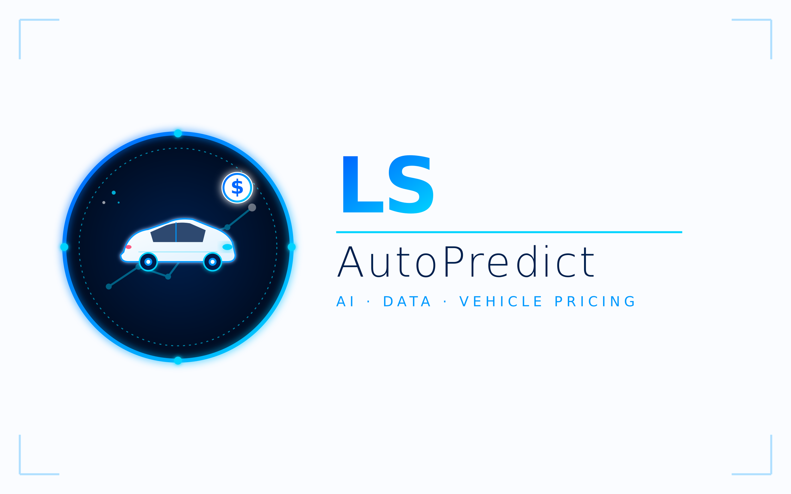
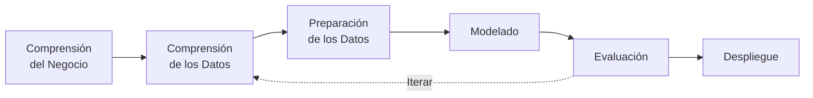

<div align="center">



# LS AutoPredict

**Aplicación inteligente para estimar el precio de vehículos BMW usados**
*Maestría en Inteligencia Artificial y Ciencia de Datos · Universidad Casa Grande*

<br>

[](https://www.python.org/)
[](https://streamlit.io/)
[](https://scikit-learn.org/)
[](https://plotly.com/)
[](https://xgboost.ai/)
[](#licencia)

<br>

[Características](#-características) ·
[Tech Stack](#-tech-stack) ·
[Instalación](#-instalación) ·
[Arquitectura](#-arquitectura) ·
[Resultados](#-resultados)

</div>

---

## 📌 Sobre el proyecto

Este proyecto es mi entrega final para la asignatura **Paradigmas de Programación para Inteligencia Artificial y Análisis de Datos**, dentro de la Maestría en Inteligencia Artificial y Ciencia de Datos de la **Universidad Casa Grande**.

La idea fue tomar un dataset real de Kaggle y llevar la solución completa: desde la exploración inicial hasta una aplicación interactiva que cualquier persona pueda usar desde el navegador. Aproveché el trabajo para mostrar cómo Python permite combinar **tres paradigmas de programación** dentro de un mismo proyecto sin que el código se vuelva un caos.

> 🎯 **El objetivo**: estimar el precio de un BMW usado a partir de sus características técnicas, con un modelo de Machine Learning entrenado sobre 10.000+ vehículos del mercado británico.

---

## ✨ Características

<table>
<tr>
<td width="50%">

### 📊 Dashboard interactivo
KPIs en vivo, gráficos dinámicos con Plotly y una vista clara del catálogo de 10.781 vehículos BMW.

</td>
<td width="50%">

### 🧹 Pipeline de limpieza
Visualización paso a paso de cómo se prepararon los datos: duplicados, valores atípicos, variables derivadas.

</td>
</tr>
<tr>
<td width="50%">

### 🔍 Análisis exploratorio
Estadísticas descriptivas, matriz de correlación interactiva y buscador con filtros personalizables.

</td>
<td width="50%">

### 📈 Visualizaciones por categoría
Pestañas organizadas: Distribuciones, Relaciones, Rankings y Tendencias temporales.

</td>
</tr>
<tr>
<td width="50%">

### 🤖 Auto-ML con LazyPredict
Compara automáticamente ~40 algoritmos de regresión y entrena el que mejor R² obtuvo.

</td>
<td width="50%">

### 🎯 Predicción en tiempo real
Formulario simple → estimación del precio en menos de un segundo, mostrando el algoritmo usado.

</td>
</tr>
</table>

---

## 🛠️ Tech Stack

<div align="center">

| Categoría | Tecnologías |
|:---:|:---|
| **Lenguaje** |  |
| **Frontend / UI** |   |
| **Datos** |   |
| **Machine Learning** |     |
| **Visualización** |   |
| **Persistencia** |  |
| **Control de versiones** |   |

</div>

---

## 📂 Estructura del proyecto

```
ProyectoUCG/
│
├── 📄 app.py                       # Aplicación Streamlit completa
├── 📋 requirements.txt             # Dependencias del proyecto
├── 📖 README.md                    # Este archivo
├── 🔒 .gitignore
│
├── ⚙️  .streamlit/
│   └── config.toml                # Tema claro con acentos azul BMW
│
├── 📊 data/
│   └── dataset_bmw.csv            # 10.781 vehículos BMW (Kaggle)
│
├── 🎨 assets/
│   ├── ls_autopredict_icono.svg   # Favicon
│   └── ls_autopredict_logo.png    # Logotipo del sidebar
│
└── 🤖 modelo_bmw.joblib            # Generado tras entrenar
```

Decidí mantener todo el código en un solo `app.py` en lugar de partirlo en muchos módulos. Para un proyecto de este tamaño me parece más claro tener la lógica a la vista y además facilita el despliegue en Streamlit Cloud.

---

## 🎯 Los tres paradigmas en acción

Una de las cosas que quise mostrar es cómo Python permite mezclar paradigmas sin sacrificar legibilidad. Cada uno cumple un rol específico dentro del proyecto:

<details open>
<summary><b>🏛️ Programación Orientada a Objetos</b></summary>

Implementada en las clases `Vehiculo` y `PredictorPrecio`. La primera representa un vehículo del dominio con sus atributos y métodos. La segunda encapsula el modelo entrenado y carga automáticamente el `.joblib` si existe.

```python
class Vehiculo:
    def __init__(self, modelo, anio, kilometraje, ...):
        self.modelo = modelo
        self.anio = anio
        ...

    def antiguedad(self, anio_ref=2024):
        return max(anio_ref - self.anio, 0)

    def es_premium(self):
        return self.tamano_motor >= 3.0
```

</details>

<details open>
<summary><b>λ Programación Funcional</b></summary>

Funciones puras que reciben un DataFrame y devuelven uno nuevo, sin mutar el original. Se componen mediante `.pipe()`:

```python
def pipeline_limpieza(df):
    return (df.pipe(limpiar_espacios)
              .pipe(quitar_duplicados)
              .pipe(filtrar_precio_valido)
              .pipe(agregar_antiguedad))
```

</details>

<details open>
<summary><b>📐 Programación Declarativa</b></summary>

Las consultas analíticas usan expresiones de Pandas que se leen como SQL, sin bucles explícitos:

```python
def top_modelos(df, n=10):
    return (df.groupby("model", as_index=False)
              .agg(precio=("price", "mean"), unidades=("price", "count"))
              .sort_values("precio", ascending=False)
              .head(n))
```

</details>

---

## 📊 Sobre el dataset

Conjunto de **10.781 vehículos BMW** comercializados en el Reino Unido entre **1996 y 2020**, obtenido de Kaggle.

| # | Variable | Tipo | Descripción |
|:---:|---|---|---|
| 1 | `model` | Categórica | Modelo (24 categorías: 3 Series, 5 Series, X1, M5...) |
| 2 | `year` | Numérica | Año de fabricación |
| 3 | `price` | Numérica | **Variable objetivo** — Precio en £ |
| 4 | `transmission` | Categórica | Automatic · Manual · Semi-Auto |
| 5 | `mileage` | Numérica | Kilometraje acumulado |
| 6 | `fuelType` | Categórica | Diesel · Petrol · Hybrid · Electric |
| 7 | `tax` | Numérica | Impuesto anual de circulación |
| 8 | `mpg` | Numérica | Consumo en millas por galón |
| 9 | `engineSize` | Numérica | Tamaño del motor en litros |

---

## 🧪 Metodología: CRISP-DM



| Fase | Lo que hice |
|---|---|
| **1. Negocio** | Definir el problema: estimar precios de BMW usados |
| **2. Datos** | Estadísticas descriptivas, distribuciones, correlaciones |
| **3. Preparación** | Limpieza, One-Hot Encoding, StandardScaler |
| **4. Modelado** | Comparación con LazyPredict (~40 algoritmos) |
| **5. Evaluación** | R², MAE, RMSE sobre conjunto de prueba (20%) |
| **6. Despliegue** | App Streamlit lista para producción |

---

## 🚀 Instalación

### 1. Cloná el repositorio
```bash
git clone https://github.com/tu-usuario/ls-autopredict.git
cd ls-autopredict
```

### 2. Creá un entorno virtual *(recomendado)*
```bash
python -m venv .venv
source .venv/bin/activate    # Linux / macOS
.venv\Scripts\activate       # Windows
```

### 3. Instalá las dependencias
```bash
pip install -r requirements.txt
```

### 4. Ejecutá la aplicación
```bash
streamlit run app.py
```

Abrí tu navegador en **`http://localhost:8501`** y listo.

---

## 🤖 Cómo entrenar el modelo

La pestaña **Predicción** de la app te guía por dos pasos:

### Paso 1 — Comparar modelos
Click en **"🚀 Ejecutar LazyPredict"**. En menos de 2 minutos verás un ranking de ~40 algoritmos ordenados por R² ajustado.

### Paso 2 — Entrenar automáticamente
La app detecta cuál fue el modelo top del ranking y muestra:
> 🏆 *Modelo recomendado por LazyPredict: **XGBRegressor***

Un click en el botón y se entrena sobre el dataset completo. El `.joblib` queda guardado y la predicción ya usa el modelo real.

> 💡 Si todavía no entrenaste el modelo, la app usa una fórmula heurística básica como respaldo para que la interfaz no quede vacía.

---

## 📈 Resultados

Con **XGBoost** entrenado sobre los 10.664 vehículos limpios:

<div align="center">

| Métrica | Valor | Interpretación |
|:---:|:---:|:---|
| **R² ajustado** | `0.9366` | Explica el 94% de la variabilidad del precio |
| **R²** | `0.9405` | Coeficiente de determinación |
| **RMSE** | `£ 2,967` | Error cuadrático medio |
| **MAE** | `£ 1,800` | Error absoluto medio |

</div>

### Top 5 algoritmos (ranking de LazyPredict)

| # | Modelo | R² Ajustado | RMSE (£) | Tiempo (s) |
|:---:|---|:---:|:---:|:---:|
| 🥇 | **XGBRegressor** | 0.9366 | 2,967 | 0.44 |
| 🥈 | ExtraTreesRegressor | 0.9353 | 2,998 | 1.36 |
| 🥉 | RandomForestRegressor | 0.9273 | 3,178 | 1.67 |
| 4 | BaggingRegressor | 0.9227 | 3,277 | 0.19 |
| 5 | GradientBoostingRegressor | 0.9143 | 3,451 | 0.30 |

Los algoritmos basados en **ensambles de árboles** dominaron el ranking. La regresión lineal y sus variantes quedaron muy por debajo, lo que confirma que hay relaciones no lineales importantes entre las variables.

---

## 💡 Lo que aprendí

> **CRISP-DM ayuda a no perderte.** Tener las fases marcadas evita saltar al modelado antes de tiempo.

> **LazyPredict es un acelerador, no una bala de plata.** Te da una idea rápida de qué familia de algoritmos vale la pena, pero después hay que afinar el modelo elegido.

> **Mezclar paradigmas se siente natural en Python** cuando cada uno se usa donde corresponde. Forzar todo a OOP cuando una función pura basta termina siendo contraproducente.

> **Streamlit es ideal para prototipos**, pero hay que pelearse un poco con el CSS si querés que la app tenga personalidad propia.

---

## 👤 Autor

<div align="center">

<table>
<tr>
<td align="center">

**Luis Alexander Suárez Colimba**

*Estudiante de Maestría · Desarrollador*
Maestría en Inteligencia Artificial y Ciencia de Datos
Universidad Casa Grande · Ecuador 🇪🇨

📧 [luissuarez2t@gmail.com](mailto:luissuarez2t@gmail.com)

</td>
</tr>
</table>

</div>

---

## 📜 Licencia

Proyecto académico desarrollado con fines educativos. El dataset original es público y fue obtenido de Kaggle.

<div align="center">

---

⭐ *Si este proyecto te resultó útil o interesante, considerá darle una estrella en GitHub.*

**Made with 💙 and Python · 2026**

</div>
